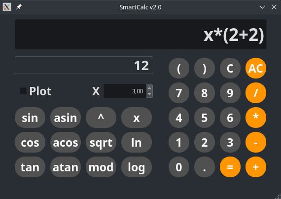
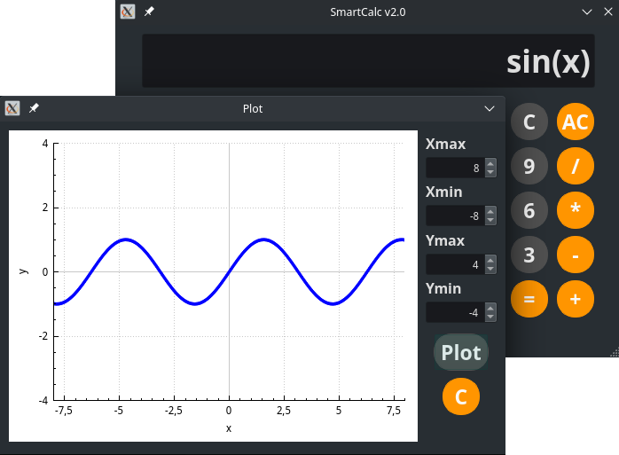

# SmartCalc v2.0

В проекте реализован калькулятор на языке программирования С++ в парадигме объектно-ориентированного программирования. Помимо базовых арифметических операций (плюс-минус и умножить-поделить), калькулятор имеет возможность вычислять арифметические выражения с учетом приоритетов, а так же некоторые математические функции (синус, косинус, логарифм и т.д.). Помимо вычисления выражений калькулятор поддерживает использование переменной _x_ и построение графика соответствующей функции.

## Описание функционала SmartCalc v2.0

- Программа разработана на языке С++ стандарта C++17 с использованием компилятора g++. 
- Программа реализована с использованием паттерна MVC 
- Код программы находится в папке src 
- Сборка программы настроена с помощью Makefile со стандартным набором целей для GNU-программ: all, install, uninstall, clean, dvi, dist, test, gcov_report. Установка производится в каталог SmartCalc_v2.0/build
- Программа разработана в парадигме объектно-ориентированного программирования
- Обеспечено покрытие unit-тестами модулей, связанных с вычислением выражений, с помощью библиотеки GTest
- Графический пользовательский интерфейс реализован на базе Qt
- На вход программы могут подаваться как целые числа, так и вещественные числа, записанные как через точку, так и в экспоненциальной форме записи
- Вычисление производится после полного ввода вычисляемого выражения и нажатия на символ `=`
- Вычисление произвольных скобочных арифметических выражений в инфиксной нотации
- Вычисление произвольных скобочных арифметических выражений в инфиксной нотации с подстановкой значения переменной _x_ в виде числа
- Область определения и область значения функций ограничена числами от -1000000 до 1000000
- Максимальная длина вычисляемого выражения - 255 символов
- Построение графика функции, заданной с помощью выражения в инфиксной нотации с переменной _x_  (с координатными осями, отметкой используемого масштаба и сеткой с адаптивным шагом)

